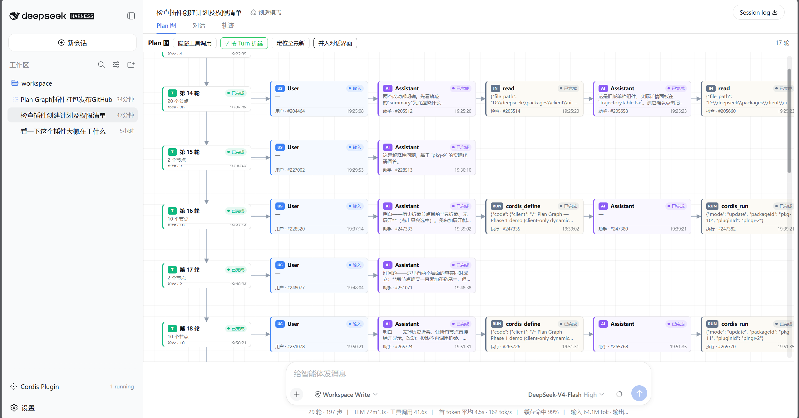

# DSH-Plan-Graph

[English](README.md) | 中文



DeepSeek Harness 轨迹视图的客制化版本：以交互式流程图展示会话中的工具调用和消息，并作为一个独立于主仓库的 [DeepSeek Harness](https://github.com/deepseek-ai/deepseek-harness) 插件包进行分发。

该插件会在会话视图切换区中添加一个 **Plan Graph（计划图）** 标签页。其中包含支持平移和缩放的画布、按状态着色的节点卡片（检查、运行、等待、验证等类别，以及耗时和推理内容）、所选节点的详情面板，以及一组工具栏功能：**隐藏工具调用**、**按轮次分组**、**跟踪最新节点**和**合并到对话**（将图形渲染到对话页面真正的右侧边栏中）。

pkg-3 在图形之上新增三项功能：

- **收藏夹** — 工具栏按钮打开的、在视图底部水平居中的面板（彩色 kind 色块 + 摘要 + 时间）。按会话隔离，以 JSON 形式持久化在 `localStorage` 的 `dsh.plan-graph.fav.<sessionId>` 中，按节点 id 去重，上限 100 条。加入方式为节点右键菜单或拖拽节点到工具栏收藏按钮。点击条目将图形平移到该节点并闪烁高亮；若该节点已离开当前窗口（partial 完成、节点分页滚出），则按 seq/callId 兜底定位到对应的对话行。移出收藏夹通过节点右键菜单实现。
- **节点右键菜单** — 右键节点弹出菜单：加入/移出收藏夹、定位至对话区（仅工具节点）、复制节点信息、查看详情。点击外部、按 Escape 或操作画布时关闭。收藏夹仅通过本菜单（及拖拽到工具栏收藏按钮）管理，详情面板无 ★ 按钮。
- **定位到对话** — 把工具调用节点映射到其对话行（`snapshot.chat.nodes` + `data-chat-flow-key` DOM 锚点），用 `MutationObserver` 等待该行出现后滚动到可见并闪烁高亮；10 秒超时后静默降级为图内定位。若部署方提供了上游 `chatLocate` 可选服务，则优先走该服务。

浏览器端沿用了原始的 Plan Graph 动态插件代码（pkg-3），并封装为 Web 模块加载器的交接格式。它使用纯 JavaScript 编写，不包含任何构建时依赖。通过 Git 安装后，`prepare` 会运行 `scripts/build-client.mjs`，根据 `client.body.js` 重新生成 `client.js`。

自 0.1.0（pkg-20）以来的变更：pkg-21 —— 用户/指引节点显示「输入」、上下文节点显示「已完成」而非 idle；pkg-22 —— 拖动画布不再选中文本（`user-select: none` + mousedown 时 `preventDefault`）；pkg-3 —— 收藏夹（持久化、拖入添加）、节点右键菜单、定位到对话；pkg-4 —— 图内闪烁高亮改为由 CSS 动画的 `animationend` 自行清除（动态客户端环境禁用浏览器 timer 全局，因此不使用 `setTimeout`）；pkg-5 —— 收藏夹 UI 改为下拉面板形态（彩色 kind 色块 + 摘要 + 定位图标 + 详情面板 ★ 按钮）；pkg-6 —— 面板改为在视图底部水平居中渲染，并移除逐条 × 移除按钮；pkg-7 —— 右键菜单调整顺序，「定位至对话区」位于收藏夹切换下方；pkg-8 —— `chatNodeVisibility` 服务补上 `subscribe(fn)`（其消费方在 Chat 渲染时调用该方法；缺失时切回对话区会白屏）；pkg-9 —— 移除右键菜单「定位到图内」与详情面板 ★ 按钮（收藏夹仅经右键菜单管理），收藏条目记录节点 seq，节点离开窗口时按 seq/callId 兜底定位到对话行；pkg-10 —— 收藏夹条目移除定位图标。

## 安装

在任意目录运行：

```sh
dsh plugin --profile demo add github:HR2AY/DSH-Plan-Graph#<sha>
dsh --profile demo
```

- **从 GitHub 安装**（本仓库）：pnpm 获取的是**源代码，而不是构建产物**，并且在明确加入允许列表之前，不会运行该包的 `prepare` 脚本。请将 pnpm 输出的准确包键复制到该配置档案的 `pnpm-workspace.yaml` 中：

  ```yaml
  allowBuilds:
    dsh-plan-graph: true
  ```

  然后重新运行 `add`。这项许可意味着允许该软件包在安装期间执行其代码。请固定到具体提交（`#<sha>`），并且只安装你信任的源代码。
- **从本地检出目录安装**：`dsh plugin --profile demo add ./DSH-Plan-Graph`
- **从压缩包安装**（不需要构建许可）：先在本目录运行 `pnpm pack`，然后运行 `dsh plugin --profile demo add ./dsh-plan-graph-0.3.0.tgz`
- **从 npm 安装**（发布后）：`dsh plugin --profile demo add dsh-plan-graph`

无需启动即可验证该层：运行 `dsh --profile demo --dump-config` 后，应能看到一个 `# == dsh-plan-graph` 层。

## 运行要求

- 浏览器端通过标准客户端插件服务（`slots`、`locale`、`layout`）注册到 `conversation.view` / `details`；这些服务均由 dsh Web 界面提供。
- “隐藏工具调用”功能提供了可选的 `chatNodeVisibility` 服务。目前随 dsh 提供的 `ui-conversation` 尚未使用该服务，因此在未打补丁的 dsh 中，此开关不会隐藏聊天页面上的内容（图形本身仍会遵循该设置）。如果部署所用的 `ui-conversation` 已使用此服务，则可以实时过滤聊天内容。
- 新会话仍默认显示 Chat 视图，只需点击一次即可切换到 Plan Graph。若部署方希望默认优先显示图形，需要自行提供上游的 `conversationDefaultView` 服务（`{ id: 'plan-graph' }`）。
- “定位到对话”读取共享的会话快照，并以对话行的 `data-chat-flow-key` 锚点为定位目标。该锚点是随附聊天视图的视图层约定；若未来 dsh 修改了它，该功能会静默降级为图内定位，而不会报错。

## 重新生成客户端包

运行 `npm run prepare`（或 `node scripts/build-client.mjs`）会根据 `client.body.js` 重写 `client.js`。请始终编辑源文件 `client.body.js`，不要编辑生成的文件。

## 目录结构

```text
├── package.json            # dsh.bundle 和 dsh.client 清单
├── index.js                # 空的主机端部分（仅浏览器插件）
├── client.js               # 生成文件：加载器交接代码与插件主体
├── client.body.js          # 插件函数主体（唯一可信源）
├── cordis.patch.yml        # 配置档案列出本插件包时插入的层
├── scripts/build-client.mjs
├── README.md
└── README.zh.md
```
